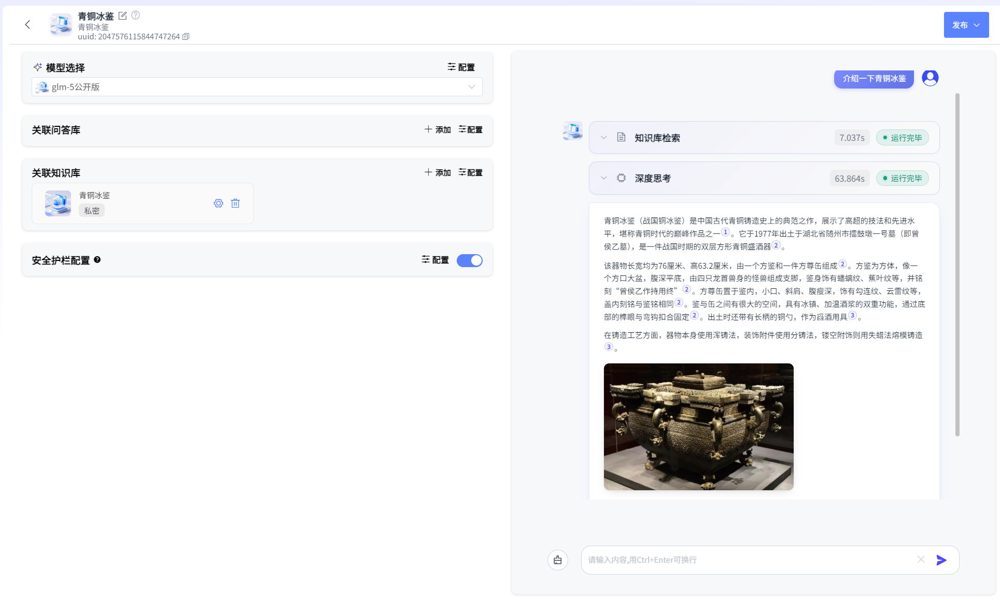
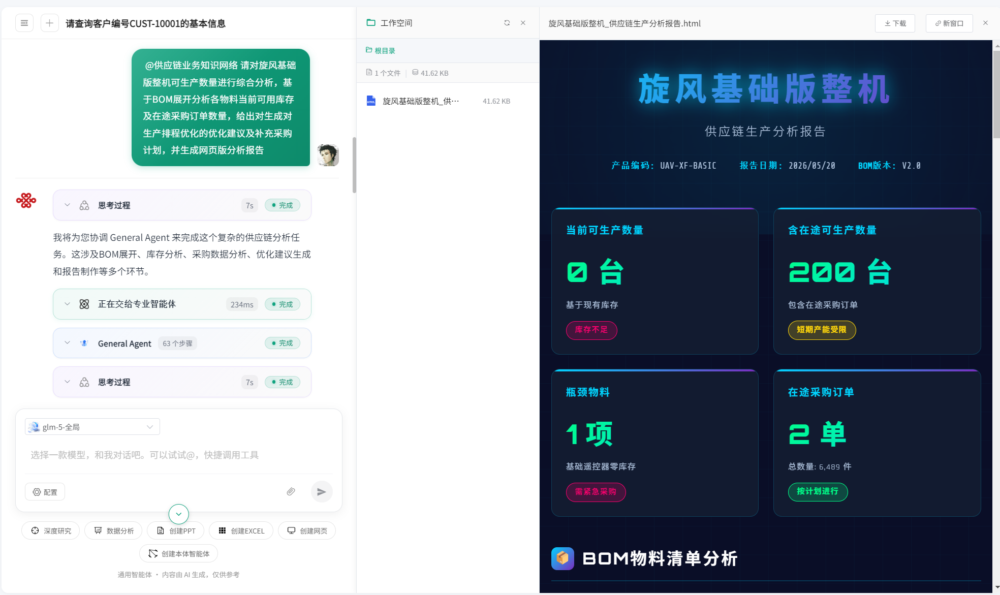
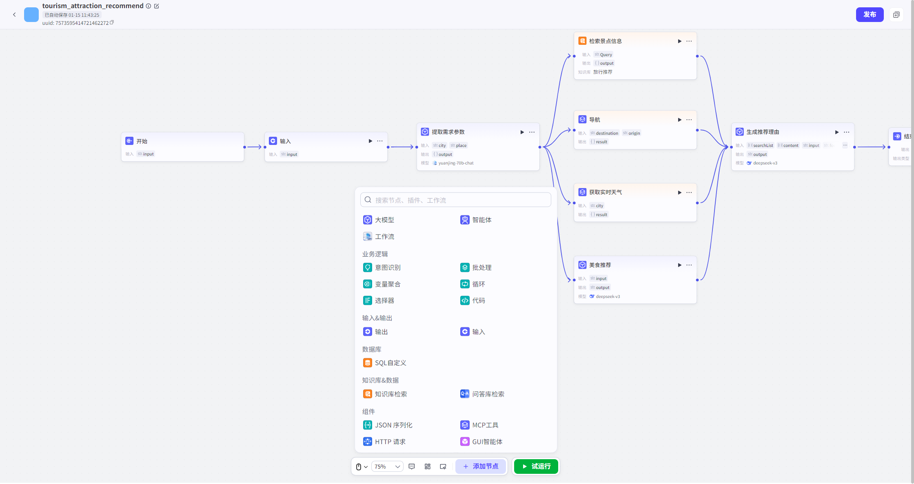
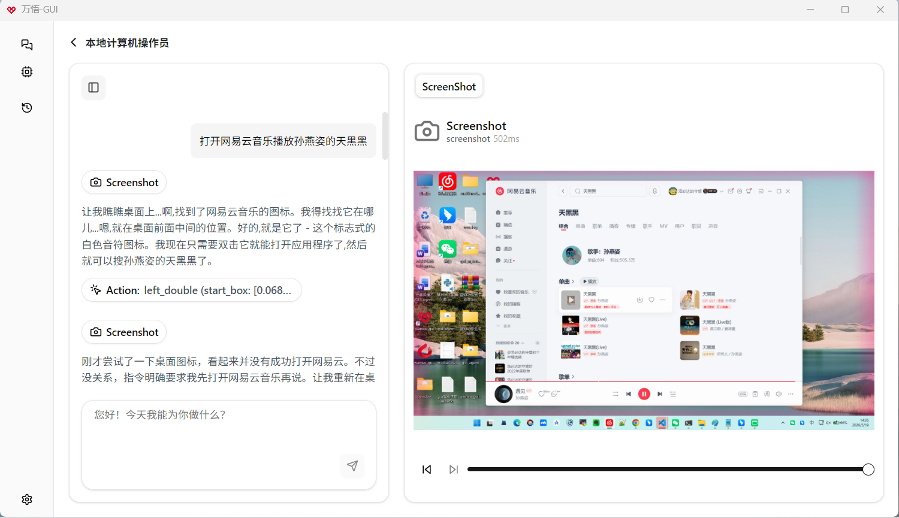
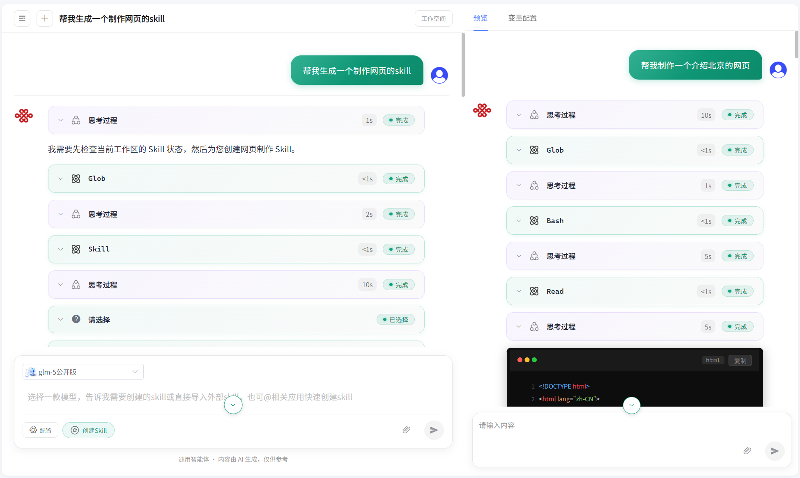

# 平台产品介绍

**元景万悟智能体平台**是一款面向**企业级**场景的**一站式**、**商用license友好**的智能体开发平台。我们以“技术开放、生态共建”为核心理念，致力于为企业提供安全、高效、合规的AI解决方案。

&emsp;&emsp;&emsp;万悟致力于提供**FDE（前沿部署工程师）所需要的所有工具能力，形成全站FDE工具链**！我们不仅能力覆盖企业核心资产，更以客户为中心，把能力真正嵌入客户系统，**大幅降低AI项目交付门槛**，打通从“构建”到“现场”的最后一公里，让每一次业务决策更简单，让每一位FDE更强大！

------

### 🌟 全站FDE工具链：5大能力对症下药

面对企业复杂的业务场景，万悟提供5大核心智能体能力，对症下药解决各类交付痛点，让AI不仅“想得到”，更“做得到”：

#### 1️⃣ RAG/知识库智能体：搞定分散文档，让AI有靠谱记忆

针对企业海量分散的文档与制度，提供全流程知识管理能力，构建高精准度、带记忆的知识大脑，让AI不再胡说八道。

- **高精度解析与检索**：支持12种文件格式及URL抓取；支持OCR与MinerU模型私有化解析；集成多模态检索、级联/自适应切分与智能精排，支持图文并茂生成与出处引用。
- **知识图谱增强（GraphRAG）**：内置UniAI-GraphRAG，结合领域本体建模，显著提升跨多文档总结与多跳关系推理的完整性与逻辑性，F1值业界领先。
- **[外部知识库兼容](https://github.com/UnicomAI/wanwu/blob/main/configs/microservice/bff-service/static/manual/2.%E7%9F%A5%E8%AF%86%E5%BA%93/%E8%BF%9E%E6%8E%A5%E5%A4%96%E6%8E%A5%E7%9F%A5%E8%AF%86%E5%BA%93.md)**: 支持API导入Dify内创建的知识库，并在智能体、文本问答、工作流中进行检索召回

#### 2️⃣ 本体智能体：搞定结构化数据，实现多步推理与决策

打破大模型仅懂文本的局限，应对复杂的结构化业务数据。

- **深度推理与决策**：基于企业数据与文档自动构建业务知识网络，赋予AI深度推理与闭环行动能力，让大模型真正懂业务、会决策，从“知识问答”跃升为“业务分析大脑”。

#### 3️⃣ 工作流智能体：搞定复杂流程，让AI按规矩办事

针对合同审核、报销审批等复杂业务，通过低代码方式规范AI的执行路径，确保交付稳定可靠。

- **可视化编排**：低代码拖拽画布，内置条件分支、API、大模型、知识库、代码、MCP等丰富节点，支持端到端流程调试与性能分析，让AI严格按照业务规矩办事。
- **零代码编排闭环**：行业内首个支持在智能体开发中零代码调用Skill，从“意图识别”到“技能执行”完美闭环；灵活调用内置工具、MCP、工作流等，秒读百页文档，统一工作区展示成果。

#### 4️⃣ GUI智能体：搞定各类应用系统，无API也能直接操作

面对老旧系统或无API场景，赋予AI“看”与“点”的能力，彻底消除系统集成壁垒。

- **界面级交互**：无需对接底层API，AI直接操作应用界面完成任务。
- **[沙箱支持](https://github.com/UnicomAI/wanwu/blob/main/configs/microservice/bff-service/static/manual/8.%E9%80%9A%E7%94%A8%E6%99%BA%E8%83%BD%E4%BD%93%2F%E6%9C%BA%E5%99%A8%E4%BA%BA%E5%8A%A9%E6%89%8B-OPENCLAW%2F%E5%A6%82%E4%BD%95%E5%9C%A8%E4%B8%87%E6%82%9F%E4%B8%AD%E6%8E%A5%E5%85%A5OpenClaw%E6%9C%BA%E5%99%A8%E4%BA%BA.md)**：为每一个“机器人”提供独立Docker容器部署选项，安全执行界面操作。

#### 5️⃣ 通用智能体+Skill开发：搞定交互系统，一句话串起所有能力

行业首创“通用智能体+垂直场景Skills”双引擎，打造既“博学”又“专业”的超级智能体，一站式满足复杂交互需求。

- **[全能大脑与极简构建](https://github.com/UnicomAI/wanwu/blob/main/configs/microservice/bff-service/static/manual/2.%E8%B5%84%E6%BA%90%E5%BA%93%2FSkills.md)**：具备专业分析师级别的多步推理能力；支持“一句话创建Skill”，用自然语言即可将业务经验沉淀为专属“工具箱”。也支持将平台内的应用一键转换为Skill。

------

### 🚀 3大落地方式：直达业务现场，降低交付门槛

能力建成之后，万悟更以客户为中心提供3大落地方式，确保从平台直达业务现场，极大降低FDE的交付难度：

#### 📦 方式一：万悟平台开箱即用

直接提供万悟平台，业务人员无需任何代码开发，即可通过可视化界面创建和使用智能体、工作流与知识问答，零门槛将AI转化为生产力，快速完成现场验证与交付。

#### 🔗 方式二：API无缝嵌入现有系统

提供RESTful API（BaaS后端即服务），支持将万悟的智能能力无缝嵌入客户现有的OA、CRM、ERP等系统，配合细粒度权限控制，在不改变用户习惯的前提下，实现AI能力的深度集成与平稳交付。

#### 🖥️ 方式三：Skill + UniClaw专有客户端执行

对于需要高权限操作的场景（如控制本地电脑、发送钉钉消息等），FDE可通过万悟开发Skill，结合UniClaw专有客户端执行，轻松搞定跨系统的高权限现场操作，真正实现“想得到，做得到”，攻克交付最后一道壁垒。

UniClaw下载地址：https://maas.ai-yuanjing.com/app/uniclaw/uniclaw-official.html

------

### 🛠️ 基座与生态：强悍底层，开放开源

万悟的全站工具链离不开强大的底层基座支撑：

- 🔥 **宽松友好的 Apache 2.0 License**：支持开发者自由扩展与二次开发，商用无忧。
- ✔ **模型纳管**：支持数百种专有/开源大模型统一接入，深度适配OpenAI API标准及联通元景生态，提供多推理后端支持。
- ✔ **Skill广场**：支持内置100+行业Skill即选即用，连接外部能力无需单独开发适配器。
- ✔ **联网检索**：具备实时信息获取、多源数据整合与智能检索策略，提升回答时效性。
- ✔ **多租户架构**：提供多租户账号体系，满足成本控制、数据安全隔离与业务弹性扩展。
- ✔ **信创适配**：已获得《信创人工智能软硬件系统检验证书》，硬件层面支持华为鲲鹏CPU，软件层面兼容欧拉、CULinux、麒麟等国产操作系统，以及TiDB平凯数据库、OceanBase等国产数据库。

------

### 🚩 核心功能模块

#### **1. 模型纳管（Model Hub）**

▸ 支持 **数百种专有/开源大模型**（包括GPT、Claude、Llama等系列）的统一接入与生命周期管理

▸ 深度适配 **OpenAI API 标准** 及 **联通元景** 生态模型，实现异构模型的无缝切换

▸ 提供 **多推理后端支持**（vLLM、TGI等）与 **自托管解决方案**，满足不同规模企业的算力需求

#### **2. MCP**

▸ **标准化接口**：使 AI 模型能够无缝连接各种外部工具（如 GitHub、Slack、数据库等），而无需为每个数据源单独开发适配器

▸ **内置丰富精选推荐**：整合100+行业MCP接口，让用户方便快捷，轻松调用

#### **3. 联网检索（Web Search）**

▸ **实时信息获取**：具备强大的联网检索能力，能够实时从互联网获取最新的信息。在问答场景中，当用户的问题需要最新的新闻、数据等信息时，平台可以快速检索并返回准确的结果，提升回答的时效性和准确性

▸ **多源数据整合**：整合了多种互联网数据源，包括新闻网站、学术数据库、行业报告等。通过对多源数据的整合和分析，为用户提供更全面、更深入的信息。例如，在市场调研场景中，可以同时从多个数据源获取相关数据，进行综合分析和评估

▸ **智能检索策略**：采用智能检索算法，根据用户的问题自动优化检索策略，提高检索效率和准确性。支持关键词检索、语义检索等多种检索方式，满足不同用户的需求。同时，对检索结果进行智能排序和筛选，优先展示最相关、最有价值的信息

#### **4. 可视化工作流（Workflow Studio）**

▸ 通过 **低代码拖拽画布** 快速构建复杂AI业务流程

▸ 内置 **条件分支、API、大模型、知识库、代码、MCP** 等多种节点，支持端到端流程调试与性能分析

#### 5. 高精度知识库（RAG）

▸ 提供**知识库创建**→ **文档解析→向量化→检索→精排** 的全流程知识管理能力，支持pdf/docx/txt/xlsx/csv/pptx等 **多种格式** 文档，还支持网页资源的抓取和接入

▸ 集成 **多模态检索** 、**级联切分** 与 **自适应切分**，显著提升问答准确率

▸ 文档解析方式支持OCR和[ MinerU模型解析(标题/表格/公式等场景)](https://github.com/UnicomAI/DocParserServer/tree/main)的私有化部署及接入

#### **6. 通用智能体与Skills编排框架** 

▸ **双引擎模式**：打破传统智能体“有脑无手”的局限，跃升为“通用智能体+垂直场景Skills”双引擎平台，打造既“博学”又“专业”的企业级超级智能体

▸ **全能大脑**：通用智能体作为核心引擎，现已在深度研究、数据分析等复杂场景展现出专业分析师级别的多步推理与信息整合能力

▸ **极简Skill构建**：支持**“一句话创建Skill”**，无需代码，用自然语言描述需求即可自动生成垂直场景技能，将业务经验沉淀为专属“工具箱”

▸ **极简本体构建**：支持选择“本体智能体”进行交互问答，帮助用户进行快速分析决策。并支持自动创建“本体智能体”。

▸ **零代码编排闭环**：行业内**首个支持在智能体开发过程中零代码调用Skill**。在可视化界面直接关联Skill，实现从“意图识别”到“技能执行”的完美闭环

▸ **按需取用工具箱**：灵活配置并调用内置工具、Skills、MCP、工作流及其他智能体，让AI不仅会“想”，更会“做”

▸ **秒读百页文档**：支持上传各类文件，通用智能体可迅速解析并基于文件进行精准的深度问答与交互

▸ **统一工作区**：提供统一的成果归宿，所有交互生成的文件整洁展示，支持在线预览与一键下载

▸ **基础开发范式**：依然支持基于 **函数调用** 的传统Agent构建，支持私域知识库关联与多轮在线调试

#### 7.本体智能体

▸ 基于企业数据与文档自动构建业务知识网络，赋予AI深度推理与闭环行动能力，让大模型真正懂业务、会决策。

#### **8. 后端即服务（BaaS）**

▸ 提供 **RESTful API** ，支持与企业现有系统（OA/CRM/ERP等）深度集成

▸ 提供 **细粒度权限控制**，保障生产环境稳定运行

------

### &#x1F4D1; 使用万悟

我们为用户提供了交互式、结构化的操作指南，您可以直接在其中查看操作说明、接口文档等，极大地降低了学习和使用的门槛。详细功能清单如下：

|          功能          |                           详细描述                           |
| :--------------------: | :----------------------------------------------------------: |
|       通用智能体       | 平台深度整合了深度研究与数据分析等高级能力，实现从简单问答到复杂业务处理的全面跨越，打造你的全能AI数字助理。 |
|       本体智能体       | 基于企业数据与文档自动构建业务知识网络，赋予AI深度推理与闭环行动能力，让大模型真正懂业务、会决策。 |
|        模型管理        | 支持用户导入包括联通元景、OpenAI-API-compatible、Ollama、通义千问、火山引擎等模型供应商的LLM、Embedding、Rerank模型。[ 模型导入方式-详细版](https://github.com/UnicomAI/wanwu/blob/main/configs/microservice/bff-service/static/manual/%E6%A8%A1%E5%9E%8B%E5%AF%BC%E5%85%A5%E6%96%B9%E5%BC%8F-%E8%AF%A6%E7%BB%86%E7%89%88.md) |
|         知识库         | 在文档解析能力方面:支持12种文件类型的上传，支持url解析;文档解析方式支持OCR和[ MinerU模型解析(标题/表格/公式等场景)](https://github.com/UnicomAI/DocParserServer/tree/main)的私有化部署及接入，文档分段设置支持通用分段和父子分段。在调优能力方面:支持知识图谱、元数据管理及元数据过滤查询，支持分段内容增删改，支持对分段设置关键词标签提升召回效果，支持分段启停操作，支持命中测试等功能。在检索能力方面:支持向量检索、全文检索、混合检索多种检索模式;在问答能力方面:支持自动引用出处，支持图文并茂的生成答案。 |
|         资源库         | 同时支持导入自己的MCP服务或自定义工具或提示词，并在工作流和智能体中使用；支持用户创建MCP Server |
|        安全护栏        |        用户可以创建敏感词表，控制模型反馈结果的安全性        |
|        知识问答        | 基于私人知识库的专属知识顾问，支持知识库管理、知识问答、知识总结、个性参数配置、安全护栏、检索配置等功能，提高知识管理与学习的效率。支持公开或私密发布文本问答应用，支持发布为API |
|         工作流         | 可以扩展智能体能力边界，由节点组成，提供可视化工作流编辑能力，用户可以编排多个不同的工作流节点，实现复杂且稳定的业务流程。支持公开或私密发布工作流应用，支持发布为API，支持导入导出 |
|         智能体         | 基于用户使用场景和业务需求创建智能体，支持选模型、设置提示词、联网检索、知识库选择、MCP、工作流、自定义工具等。支持公开或私密发布智能体应用，支持发布为API和Web Url |
|        应用广场        |    支持用户体验已发布的应用，包括文本问答、工作流和智能体    |
|        MCP广场         |             内置100+优选行业MCP server，即选即用             |
|        模板广场        |               内置50+优选行业提示词，即选即用                |
|          设置          | 平台支持多租户，允许用户进行组织、角色、用户管理、平台基础配置，单点登录配置 |
| 知识图谱UniAI-GraphRAG | UniAI-GraphRAG结合领域知识本体建模、知识图谱与社区报告构建、图检索增强生成等技术可有效提升知识问答的完整性、逻辑性与可信度。可显著提升跨多文档总结与多跳关系推理等复杂问答场景的问答效果 |

------

### &#x1F3AF; 典型应用场景

- **智能客服**：基于RAG+Agent实现高准确率的业务咨询与工单处理  
- **知识管理**：构建企业专属知识库，支持语义搜索与智能摘要生成  
- **流程自动化**：通过工作流引擎实现合同审核、报销审批等业务的AI辅助决策  
- **深度研究与数据分析**：利用通用智能体+垂直Skills，自动完成行业调研、长文档深度解析与复杂数据洞察

平台已成功应用于 **金融、工业、政务** 等多个行业，助力企业将LLM技术的理论价值转化为实际业务收益。我们诚邀开发者加入开源社区，共同推动AI技术的民主化进程。  

