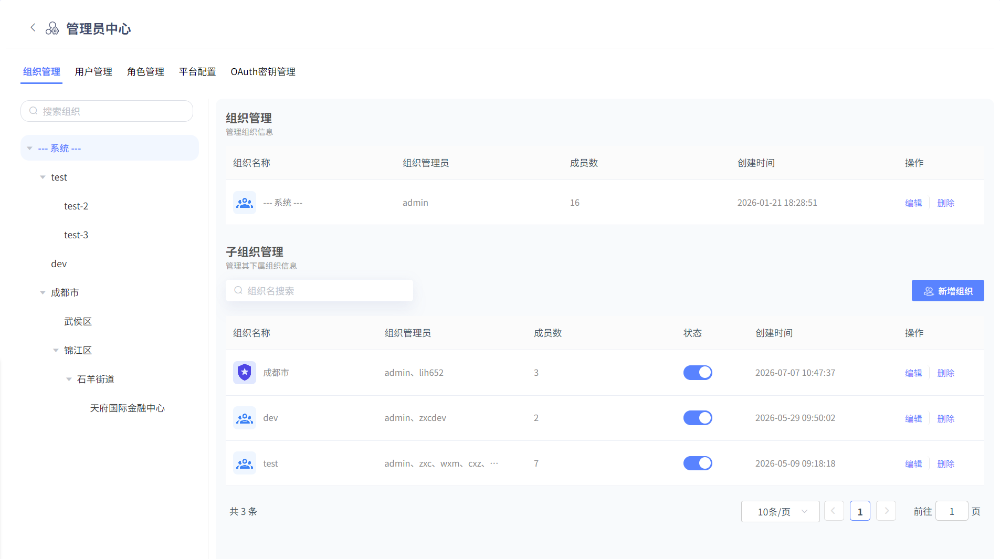
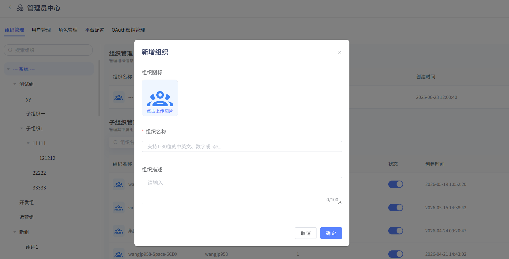
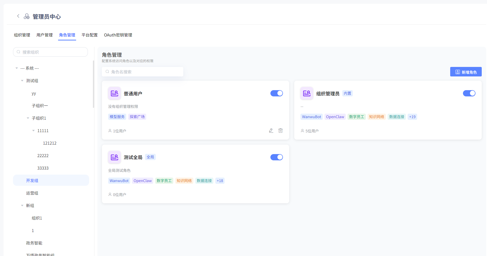
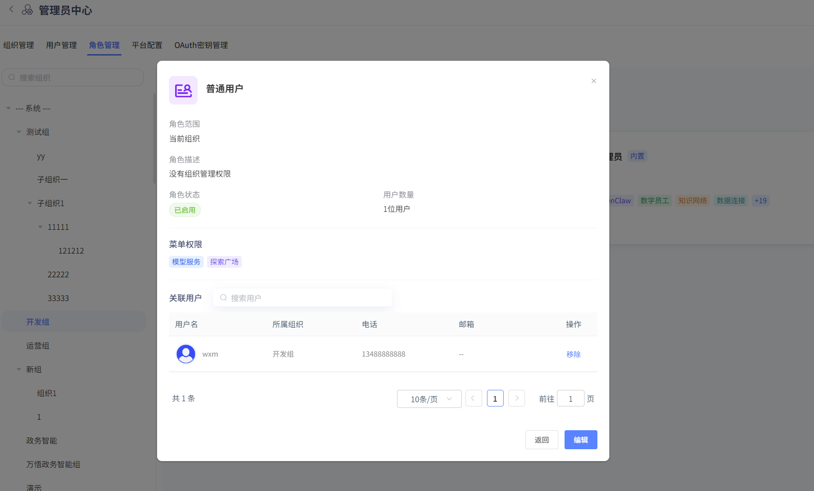
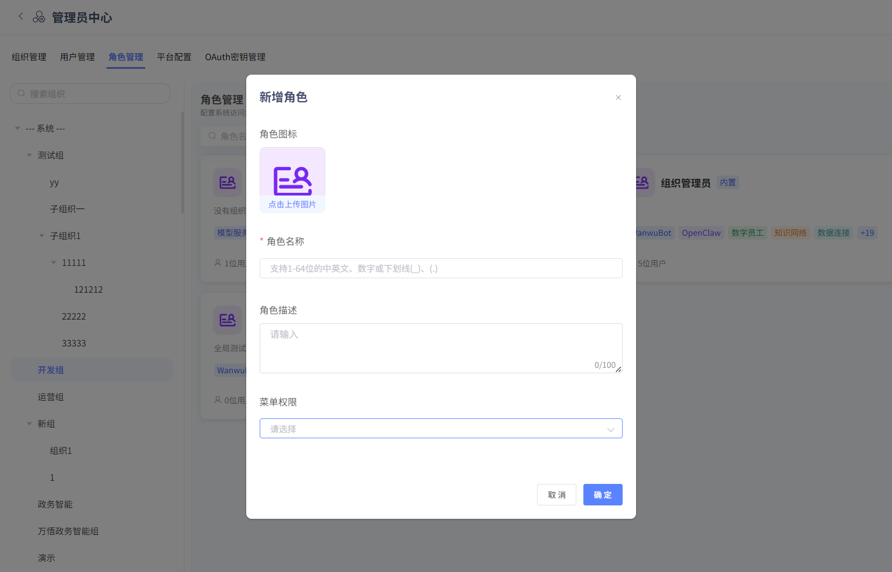
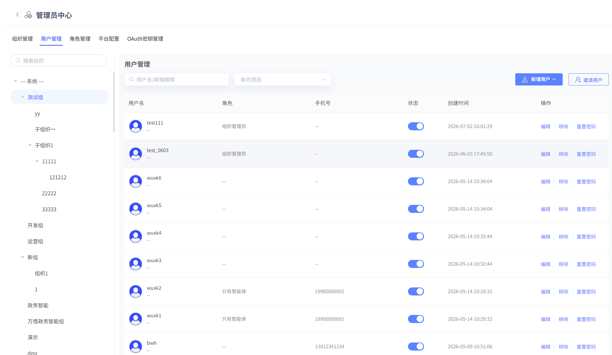
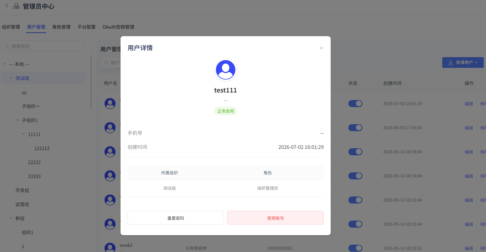
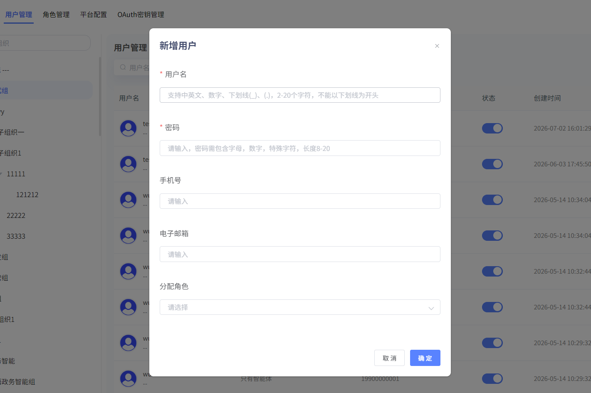
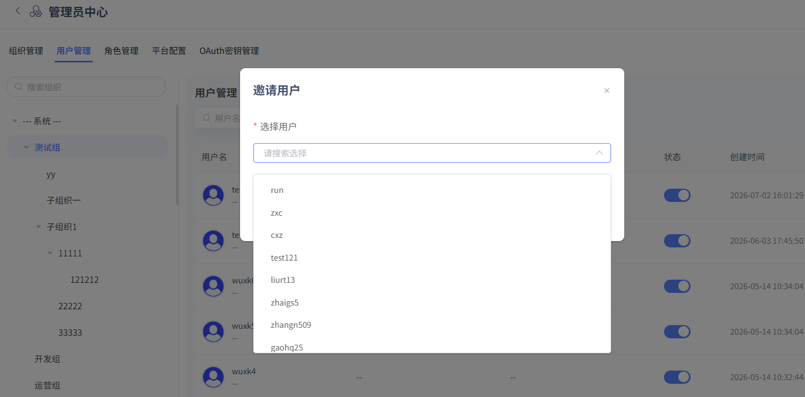
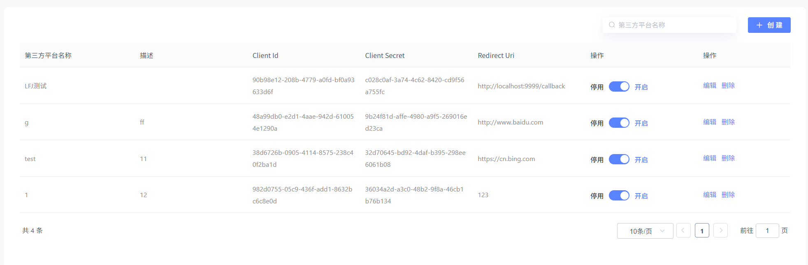

# 管理员中心

此模块可对组织、用户、角色、平台配置、OAuth秘钥统一管理。只有组织管理员、系统管理员有权限查看。

## 组织管理

### 组织查看

管理员可对该组织内所有子组织情况进行查看（点击左侧组织树），并可编辑、删除、停用和新增子组织。可统一查看组织管理员、成员数量等基础信息。

### 新增组织

点击“新增组织”，可对组织名进行设置。点击“确认”，即可完成新增子组织。用户创建下级组织时，系统默认在新组织中创建一个例如"组织管理员"角色，默认拥有新组织的所有权限；同时该用户默认加入新组织，并对应该角色。

## 角色管理

### 角色查看

管理员可对该组织内所有角色情况进行查看，并可编辑、删除、停用和新增角色。

系统管理员可创建全局角色，组织管理员可创建本组织角色。非系统管理员不可编辑操作“组织管理员”角色。同一个用户可以在多个组织中。

点击“具体角色”，可查看角色详情及角色下的用户情况。

### 新增角色

**用户可在左侧切换组织树，选择所在组织创建该组织下的角色**点击“新增角色”，可对角色名和菜单权限进行设置。点击“确认”，即可完成新增角色。

## 用户管理

### 用户查看

组织管理员可对该组织及下级组织内所有用户情况进行查看，并可编辑、删除、重置密码、新增账户和邀请用户。

系统管理员可对该系统内所有用户情况进行查看，并可编辑、删除、重置密码。**（注：系统管理员无法新增用户，只能查看用户！）**

点击“编辑”，即更改用户电话、角色、邮箱。

点击“具体用户”，可查看该用户详情。

### 新增用户

**用户需切换至具体组织（--系统--下无法新增用户！）**点击“新增用户”，可对用户名、密码、电话、角色、邮箱进行设置。点击“确认”，即可完成新增用户。用户被分配到某个组织，可不对应任何角色。新增用户支持单条或批量添加。

**邀请用户**

点击“邀请用户”，可对特定用户进行邀请。管理员可邀请该系统下任意不在该组织的用户，被邀请的用户自动加入该组织。

## 平台配置

为方便用户二次开发，提供了可视化前端界面修改入口，支持用户修改标签页、登录页、平台配置。

## OAuth密钥管理

支持用户进行单点登录设置，可在平台中配置需进行单点登录的第三方平台名称、描述、Redirect Uri。

