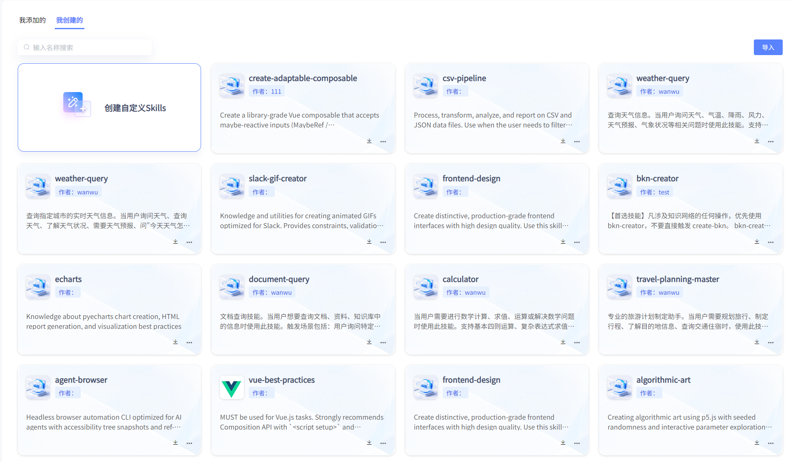
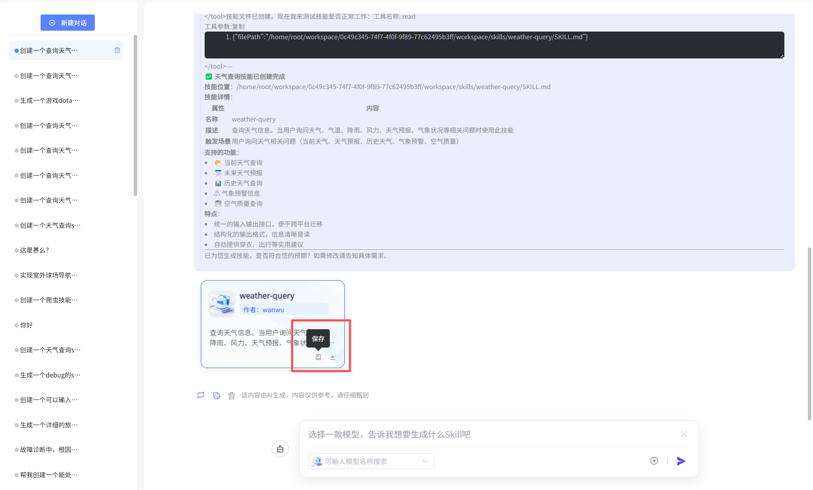
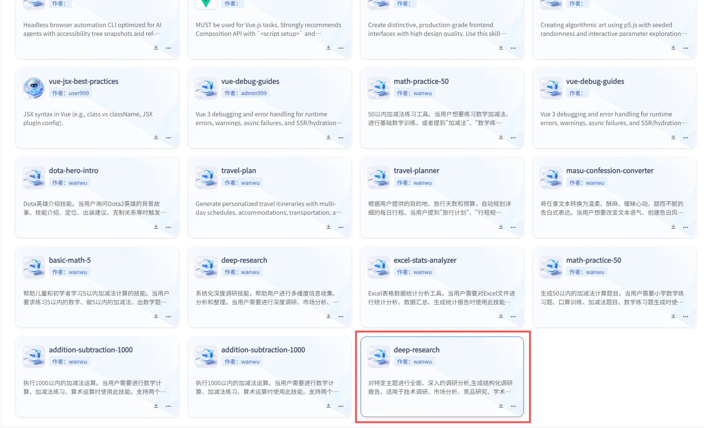
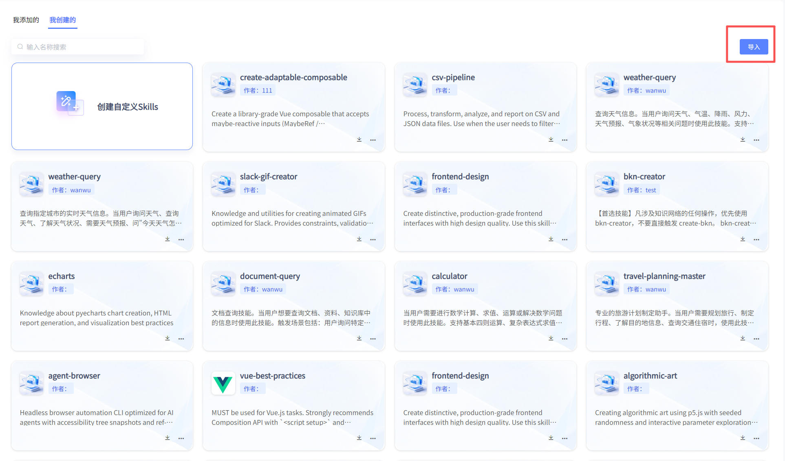
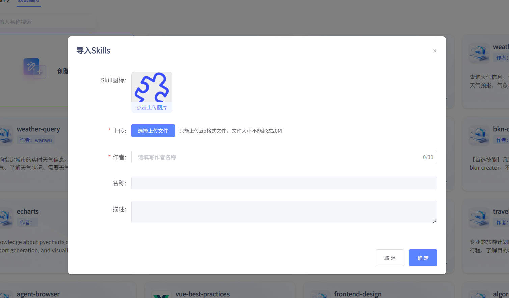

# Skills

### 我添加的

用户通过探索广场-Skill广场，发送至资源的Skill均可在本页面查看或下载。

### 我创建的

平台支持用户一句话创建skills，并保存，同时支持下载。保存后的skill可在“我创建的”页面查看详情，并支持在后续应用开发中调用。

#### 1）创建skills

点击“创建自定义skills”，用户可选择一款模型，通过自然语言对话，在平台中创建skill。同时可浏览创建历史。

#### 2）保存

生成skill后，可点击保存，发送至skill-我创建的，用于后续开发使用。

#### 3）查看skills

点击卡片，可查看生成的skills，并支持下载。

#### 4）导入skills

用户可自行导入skill的zip文件。

