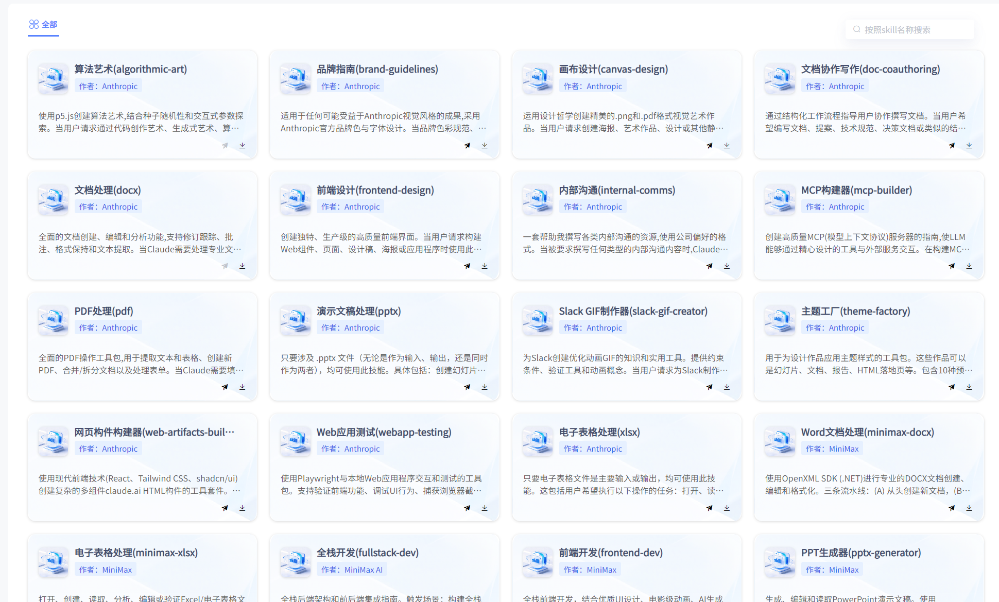
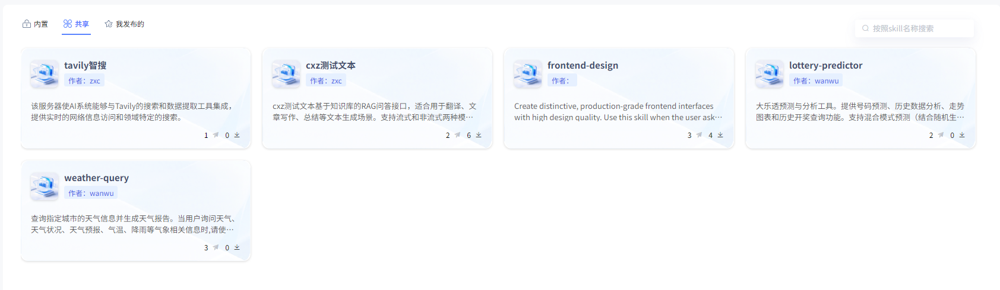
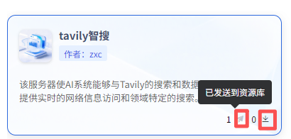
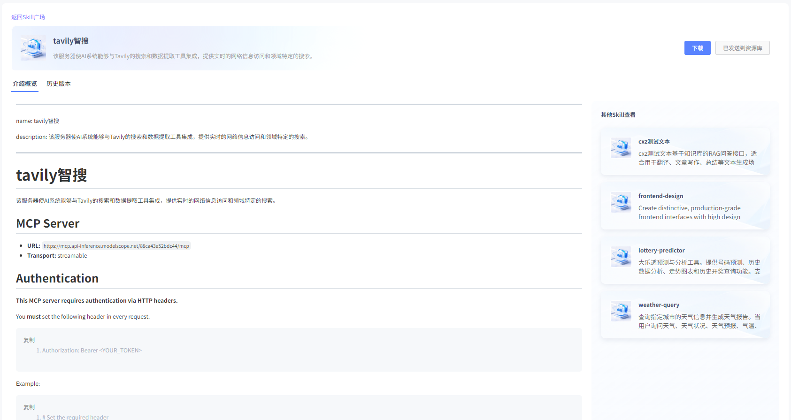
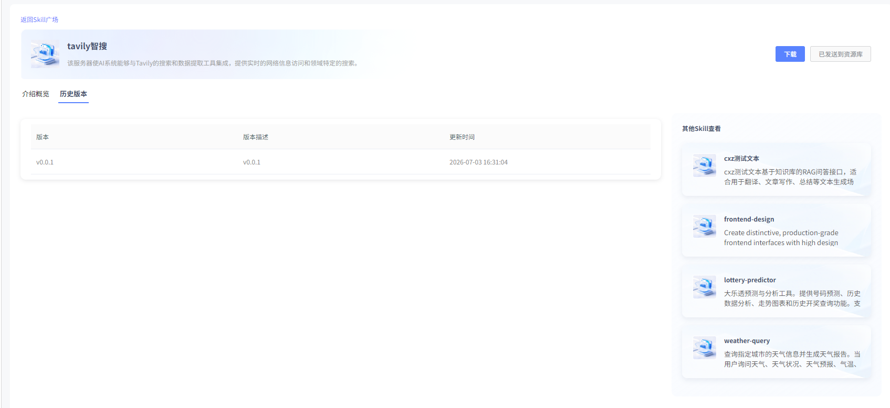
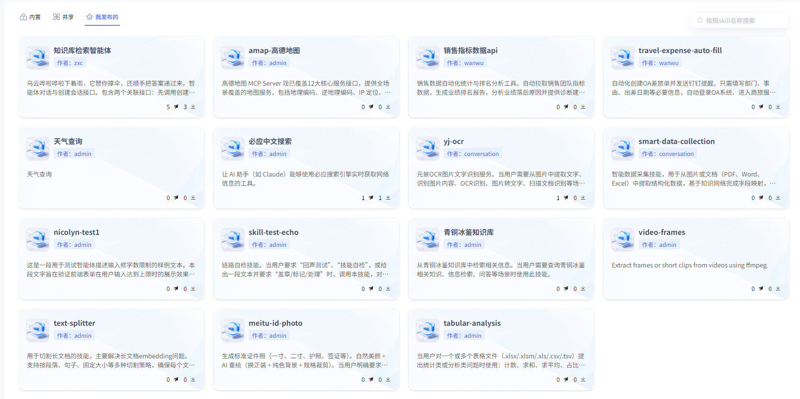
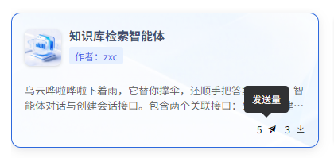

# Skill广场

## 内置

平台提供优选Skills，支持查看Skills文件并下载，下载后可无缝对接OpenClaw，详细部署操作文档可查看[OpenClaw接入Skill教程](../7.通用智能体/OPENCLAW/OpenClaw接入Skill教程.md)。

## 共享

其他用户公开发布的Skill，可在Skill广场中“共享”界面查看。也支持下载和发送至资源库使用。

## 我发布的

我创建的Skill中，所有已发布的，均可在Skill广场中“我发布的”界面查看（包含私密发布和公开发布的Skill）。同时可了解发送量和下载量。

