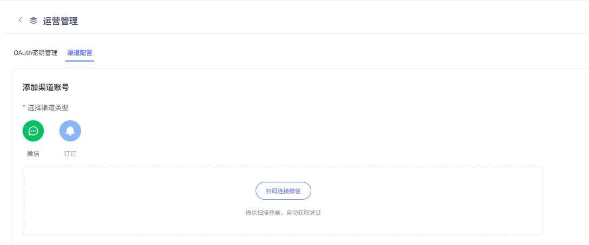
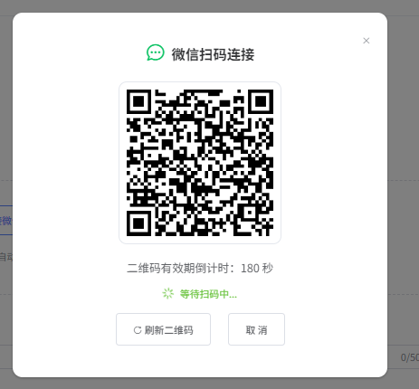
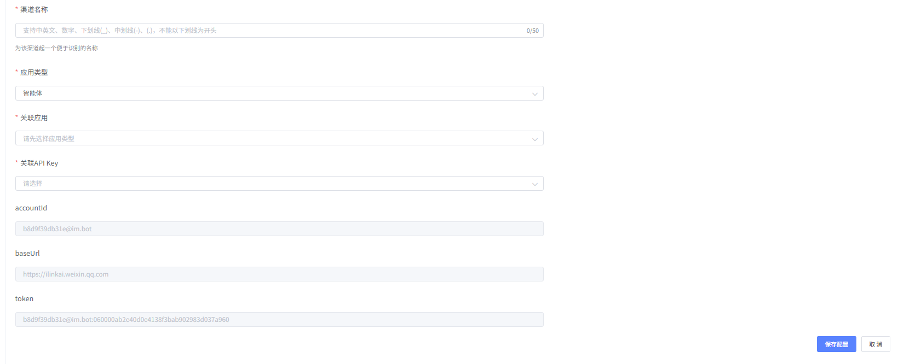
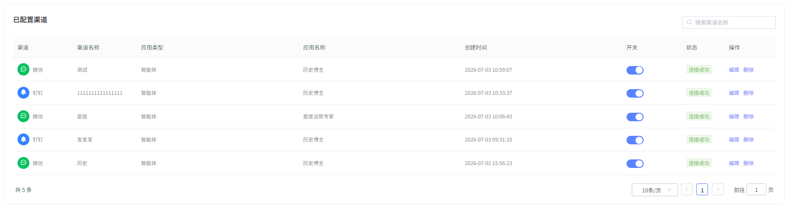
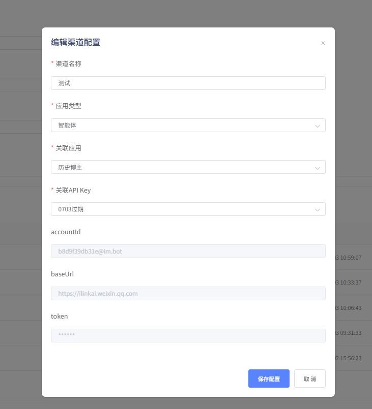
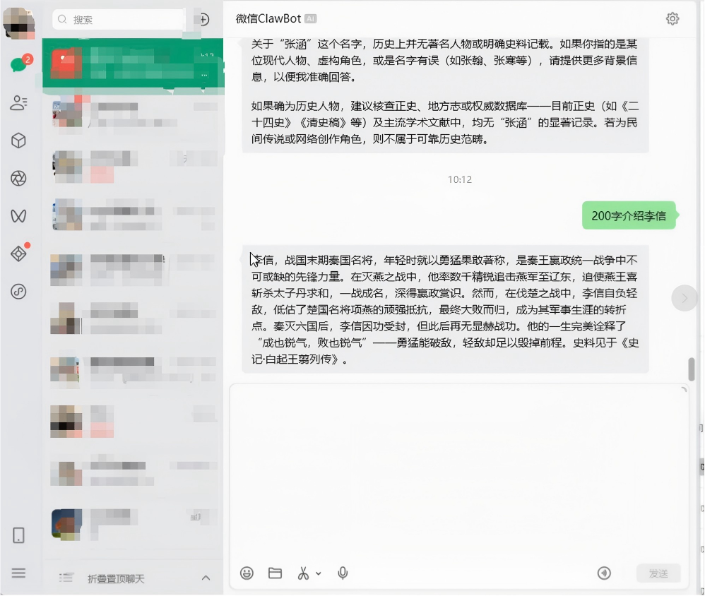

# 渠道管理

平台支持关联应用到微信、钉钉，帮助用户更加快捷方便的使用平台开发的应用。

## 1、选择渠道

点击扫描链接，利用微信和钉钉扫描二维码，可自动关联渠道。

注：目前微信官方仅支持同一账号关联一个应用，钉钉同一账号可关联多个应用。

## 2、配置关联应用

用户可自定义渠道名称，选择应用类型、关联应用，配置API Key，点击“保存配置”

## 3、查看、编辑已配置渠道

针对已经绑定成功的渠道，可统一查看和编辑渠道、名称、应用类型、应用名称、创建时间、连接状态。也可通过“开关”按钮，控制渠道开关。关闭后的渠道不支持交互使用。

## 4、使用渠道

以微信为例，绑定渠道后，可直接通过微信与平台开发的应用进行交互。

