# 连接管理

从万悟平台首页右侧菜单中：【本体智能体】->【数据连接】跳转进入平台界面


## 1.新建数据源连接


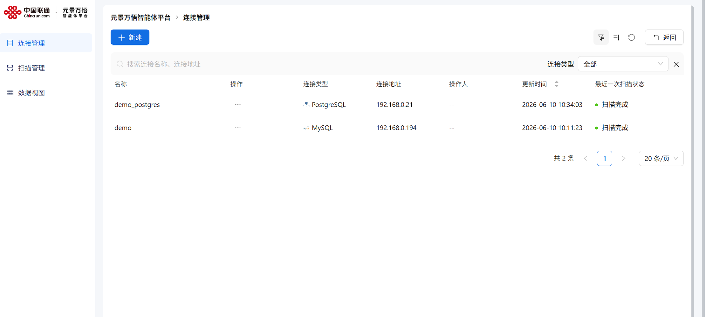

操作步骤：

1）在【连接管理】中点击【新建】按钮

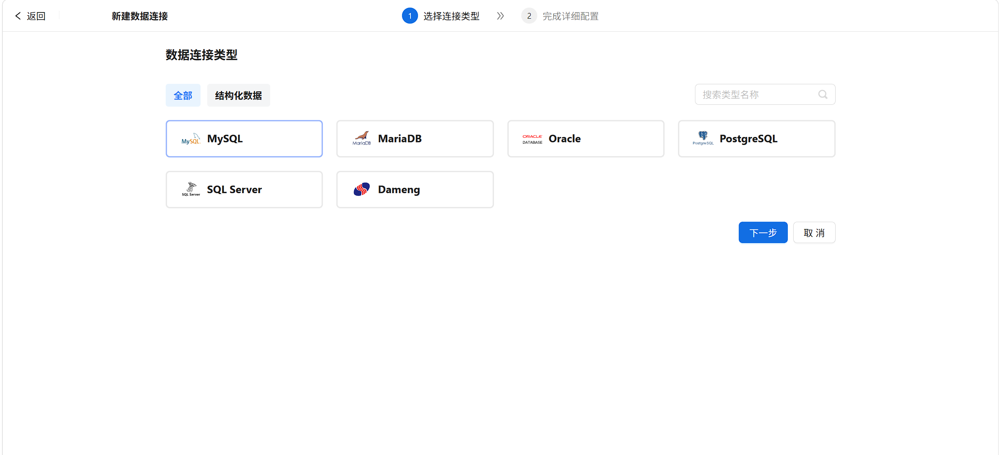

2）点击下一步，进入数据连接配置页面：

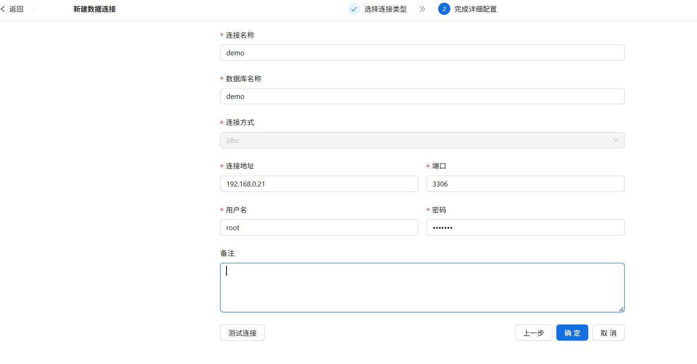

3）配置完成后，可以点击【测试连接】测试数据源连接是否可用，测试成功后，可点击【确定】保存此数据源配置。

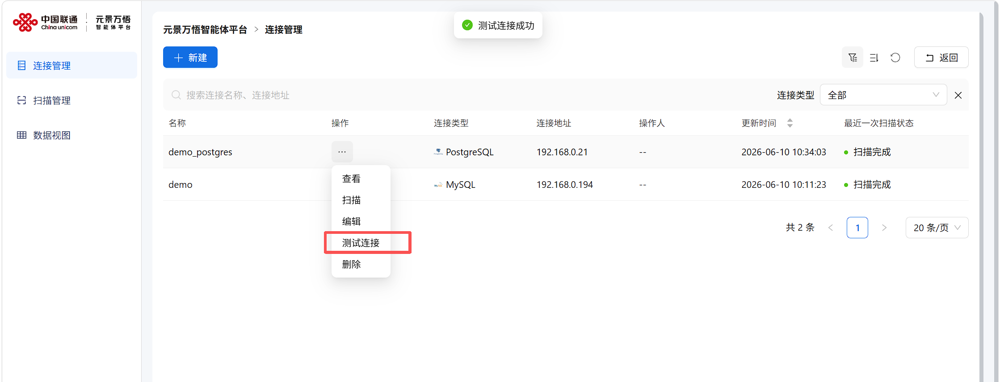

4）系统提供内置示例数据源，地址默认配置为192.168.0.21，需要修改成您服务器的真实IP地址，如密码有变化，需要重新输入密码。


5）默认数据源可以通过docker命令部署，sql脚本（示例文件见网盘：https://pan.baidu.com/s/1g3URlvWp7egFAWsbPCV6rA?pwd=yd68 提取码: yd68）在同目录下的sql目录下，请上传至服务器。docker命令需要和.sql脚本在同一目录下执行。

```bash
docker run -d \
  --name mysql-demo \
  -p 3306:3306 \
  -e MYSQL_ROOT_PASSWORD=root123 \
  -e MYSQL_DEFAULT_AUTHENTICATION_PLUGIN=mysql_native_password \
  -e DEFAULT_AUTHENTICATION_PLUGIN=mysql_native_password \
  -v $(pwd)/00-init-demo-business-data.sql:/docker-entrypoint-initdb.d/init_demo.sql \
  mysql:8.0.37 \
  --character-set-server=utf8mb4 \
  --collation-server=utf8mb4_unicode_ci \
  --default-authentication-plugin=mysql_native_password \
  --skip-character-set-client-handshake
```


## 2.新建扫描任务

新建数据源后，或创建完demo数据源，需要立即创建扫描任务，完成扫描后方可使用。

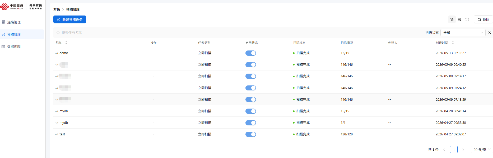

操作步骤：

1）在【扫描管理】中点击【新建扫描任务】

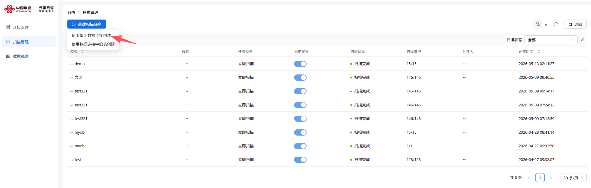

可选择使用整个数据连接创建，在弹框中选择要扫描的数据源：

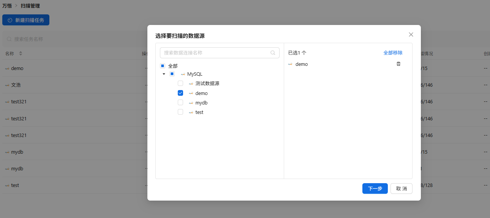

如图所示，我们勾选 上面新建的数据源后，点击下一步进行扫描任务配置：

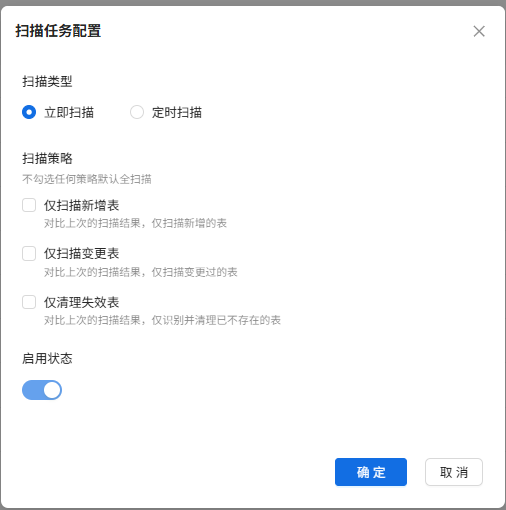

如上图所示：

1. 扫描类型：立即扫描
2. 扫描策略：可选择扫描新增表 或者 仅扫描变更表
3. 启动状态：默认为开启

勾选适合的选项操作后点击【确定】

2）创建完扫描任务后，可以在扫描任务列表中，查看扫描详情信息

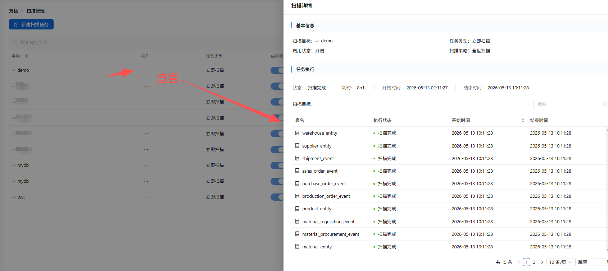


## 3.查询数据视图

**功能定义：**

原子视图是通过扫描数据连接生成的虚拟视图，支持将不同类型的数据连接以**统一数据类型**呈现，有效降低数据使用门槛，提升数据可理解性，助力用户快速开展数据相关操作。

自定义视图基于已创建的**原子视图**生成，支持对 1 个或多个原子视图的数据进行**过滤、去重**操作，生成满足特定业务需求的新视图。同时提供自定义视图的**导入、导出**及**分组管理**功能，帮助您高效组织和维护视图资源。

在【数据视图】中可以查看上面扫描任务完成后的数据库中的表、表结构、数据，如下图所示，可以选择原子视图和自定义视图。

如果选择**原子视图**可以在操作列中选择：查看\编辑\数据预览\删除等操作

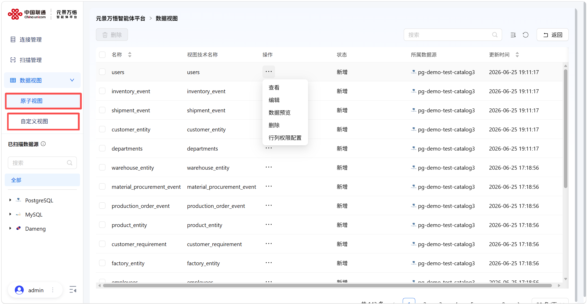

可以选择【数据预览】后，可以查询 数据库中此表的表结构和数据情况,在这里我们可以对数据进行搜索和查询，而无需到数据库执行相关查询操作


同时，点击【编辑】可以对数据视图中的字段名称（逻辑名称）进行修改操作：


如果选择**自定义视图**，可以在操作列中选择：查看\编辑\数据预览\删除等操作。自定义视图支持新建、导入功能。

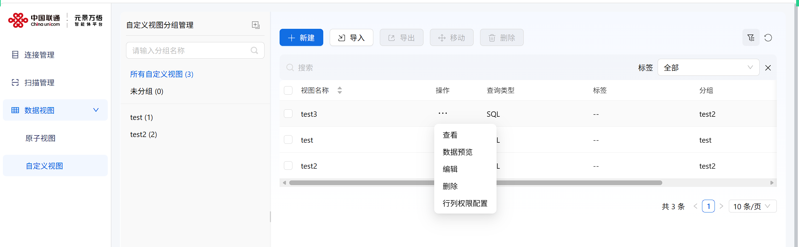

创建自定义视图时，依次填写视图名称、ID、分组、标签和描述，并选择查询类型后点击“下一步”；

`SQL`用于编写结构化查询语句。

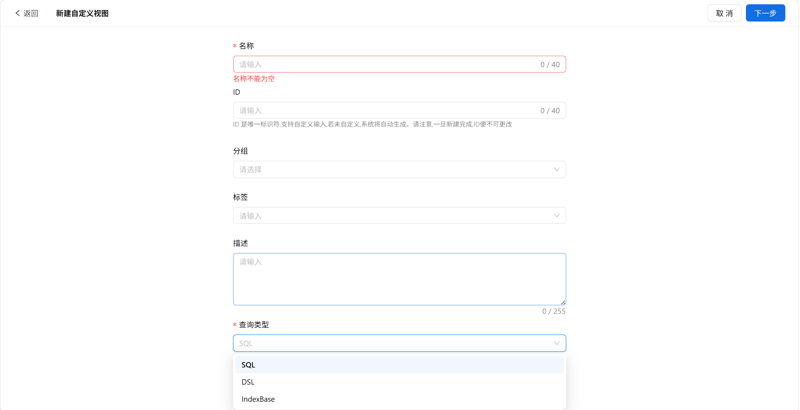

进入视图编排页面后，可通过左侧组件配置引用视图、数据合并、数据关联或SQL处理流程，并选择数据视图生成输出视图。

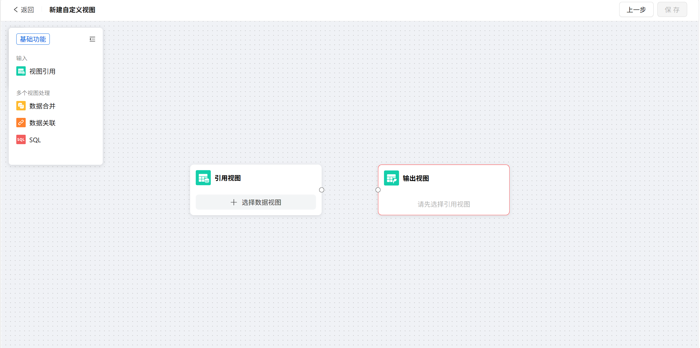

点击画布中的【引用视图】节点，画布下方弹出「数据配置」面板。

配置**数据过滤**（可选）：点击【添加过滤条件】，选择字段（如 “用户注册时间”）、运算符（如 “≥”）、值（如 “2025-07-01”），可添加多条件（支持 “且 / 或” 逻辑关联）。

配置**数据去重**（可选）：勾选【启用去重】，选择去重字段（如 “用户 ID”），系统将按所选字段删除重复数据（保留第一条匹配数据）。

点击【确定】，完成【引用视图】节点配置。

注：只有完成节点配置后，才可以连接节点。完成节点配置后，边框会显示蓝色。

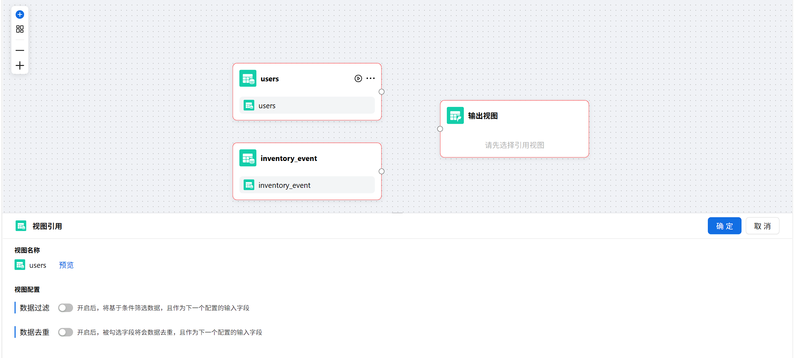

完成多个视图节点配置后，需通过`数据合并`、`数据关联`或`SQL`将结果整合为一个输出视图，然后点击保存即可创建成功。

注：输出的视图只能有一个输入。

如图，`数据合并`用于将多个视图中数据类型相同的字段合并到同一输出字段中，可添加合并规则并选择“保留所有行”或“去除重复行”作为输出方式。

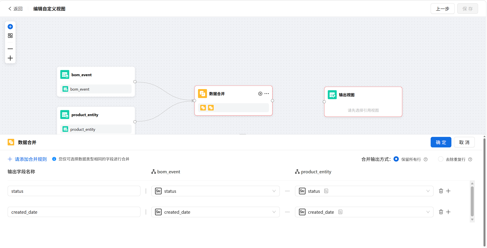

如图，当前选择`数据关联`时，左右两侧关联字段的数据类型需保持一致，其中`左联接`保留左表全部数据、`右联接`保留右表全部数据、`内联接`仅保留两表匹配数据、`全外联接`保留两表全部数据并合并匹配项。

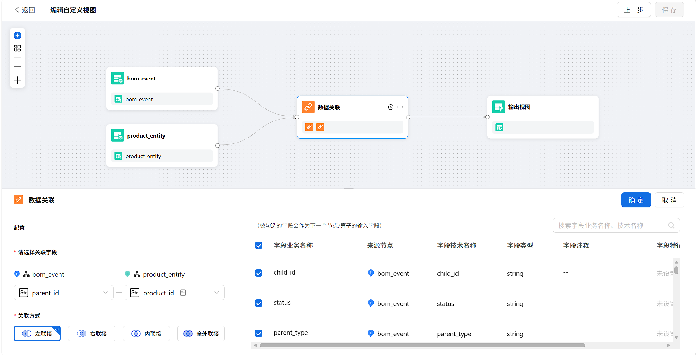

如图，`SQL配置`用于对前序节点数据编写SQL处理逻辑，可从左侧前序节点列表中引用节点或字段，点击“执行”验证结果，确认无误后点击“确定”。

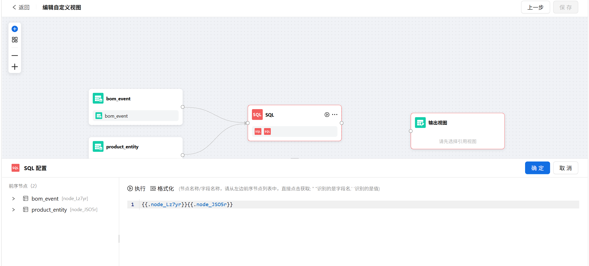


创建自定义视图后，可以在知识网络中的对象类中选取数据视图处选用。

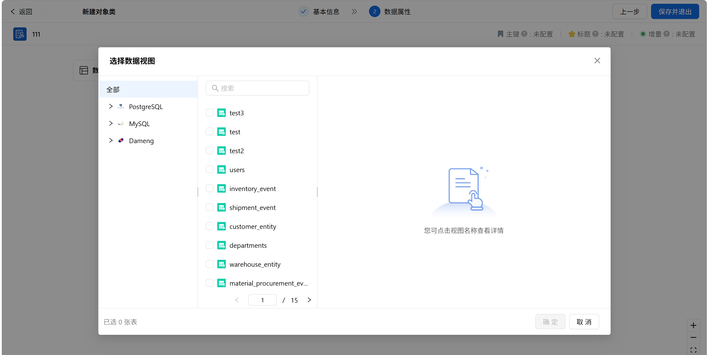