# 数字员工使用教程

## 1. 数字员工概览  

在元景万悟智能体平台左侧导航栏的“本体智能体”分类下，点击进入“数字员工”。

在【数字员工】列表页，可查看当前用户下所有数字员工，支持按名称/ID模糊查询、按草稿或已发布状态筛选，并可按名称或更新时间进行排序。

对于已经发布的数字员工，支持查看和取消发布的功能，对于未发布的数字员工支持查看、编辑、发布、删除功能。

若想修改或删除，需要先取消发布再进行下一步操作。删除后数据无法恢复，请谨慎操作。

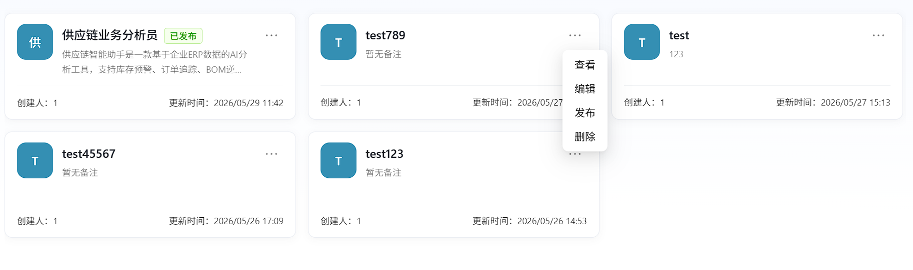

## 2.创建数字员工

点击【新建】按钮，在弹出的【新建数字员工】窗口中填写名称和简介，点击【确定】完成数字员工创建。

注：名称具有唯一性，不可重复。

 

在【基本设定】处，完成角色、任务、工作流程及技能使用优先级等信息填写后，点击【保存】。

在【技能配置】处，点击【添加技能】打开技能列表，可选择已有技能进行添加；点击【技能创建/导入】将跳转至资源库的Skill页面进行创建或导入。

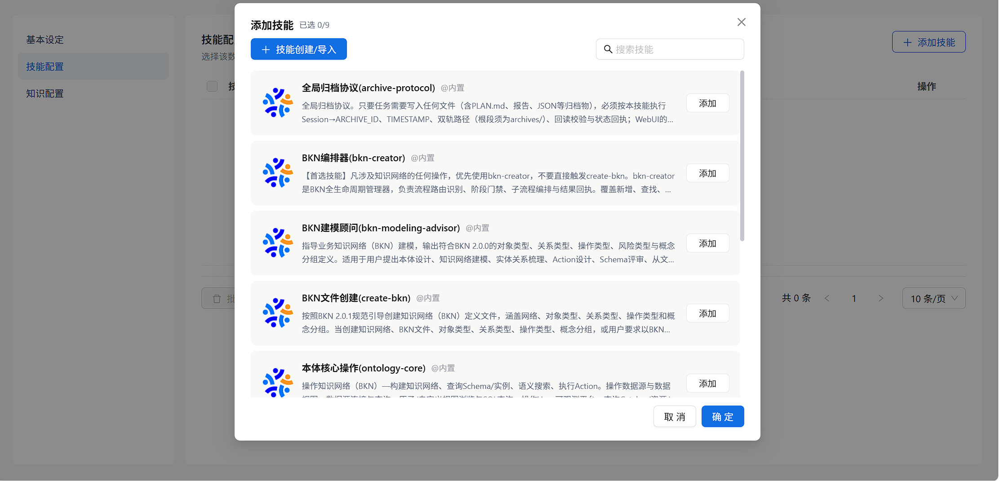

在【技能配置】列表中可同时添加多个技能，支持勾选多个技能后批量删除，也可点击单个技能右侧删除图标进行单独删除。

在【知识配置】处，点击【添加知识网络】，在弹窗中选择需要关联的知识网络并点击【添加】，最后点击【确定】完成配置。

注：只可以选择一个知识网络，若知识配置中暂无知识网络，请先去添加知识网络。

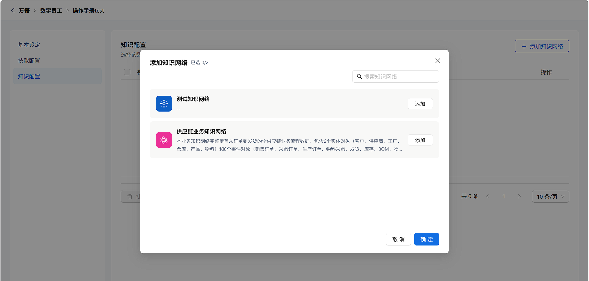

添加完成后，可在【知识配置】列表中查看已关联的知识网络，并可勾选后进行删除或批量删除操作。

三个步骤编辑填写成功后，点击保存，完成数字员工的创建。

### 嵌入配置（可选）

嵌入配置用于将数字员工以对话浮窗或全屏的形式嵌入第三方站点，访客在第三方页面即可与该数字员工问答。**此步为可选配置，不设置也能完成数字员工的创建与保存；仅当需要把数字员工嵌入第三方站点时才配置。** 配置分四块：模型配置、访问凭证、外观设置、嵌入脚本。其中敏感的 APIKey 仅在本页保存、不会进入第三方页面源码，嵌入脚本只携带公开的 EmbedId。

在左侧菜单点击「嵌入配置」即可进入该页面（与基本设定、技能配置、知识配置并列）。

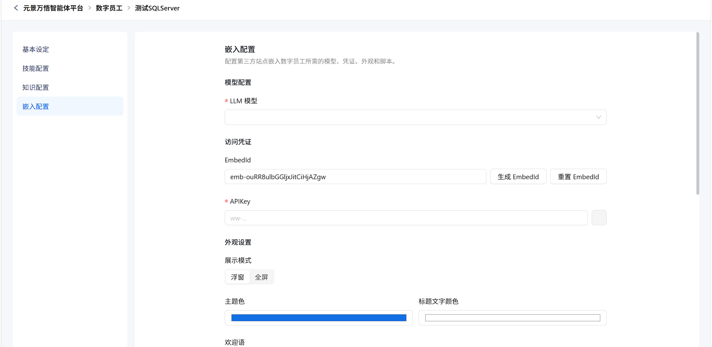

#### 模型配置

在「LLM 模型」下拉中选择该嵌入问答使用的 LLM 模型（列表来自平台的 LLM 模型，显示为 `provider / 模型名`），该项必填。

注：所选模型需与下方填写的 APIKey 归属同一用户/组织，否则对话会被上游校验拒绝。

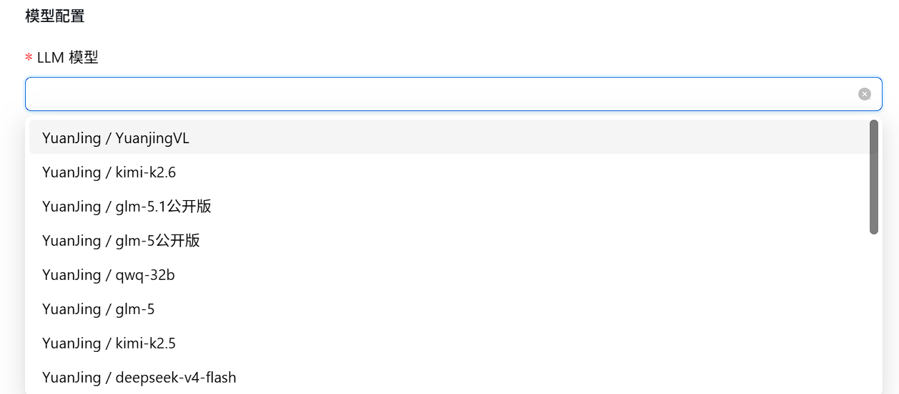

#### 访问凭证

- **EmbedId（公开）**：点击【生成 EmbedId】为该数字员工颁发公开嵌入标识；点击【重置 EmbedId】会作废旧 EmbedId（已复制的旧脚本失效，需重新复制）。EmbedId 可放第三方脚本，不涉及敏感信息。
- **APIKey（敏感）**：手动填写平台颁发的 APIKey（须以 `ww-` 开头），仅在本页保存、绝不进入第三方页面源码；右侧【复制】按钮便于本地备份。

#### 外观设置

- 展示模式：浮窗（默认，右下角悬浮按钮，点击展开对话面板）/ 全屏（撑满视口）。
- 主题色 / 标题文字颜色：通过取色器设置浮窗或全屏头部的配色。
- 欢迎语 / 欢迎描述：面板打开时顶部展示的问候文案。
- 水平位置 / 水平距离(px)：浮窗按钮水平靠左或靠右，以及距屏幕边缘的像素值。
- 垂直位置 / 垂直距离(px)：浮窗按钮垂直靠顶或靠底，以及距屏幕边缘的像素值。
- 允许拖拽：开关，开启后浮窗按钮可被拖到屏幕任意位置（仅浮窗模式生效）。

#### 嵌入脚本

- 展示推理过程：开关。开启后嵌入脚本会带 `data-render="full"`，对话区额外显示推理过程与工具调用状态；关闭（默认）则只展示最终回复。
- 「嵌入脚本」文本框会实时生成 ``，并随上方各项配置自动更新。
- 点击【复制脚本】复制到剪贴板，粘贴到第三方站点页面中即可生效。

第三方站点粘贴脚本后，访客侧的效果为：浮窗模式下页面右下角出现悬浮按钮（开启允许拖拽时可拖动），点击展开对话面板即可与数字员工问答；全屏模式下则直接以撑满视口的对话界面呈现。

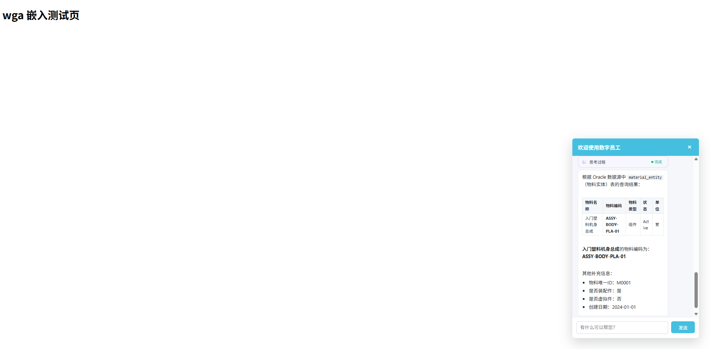

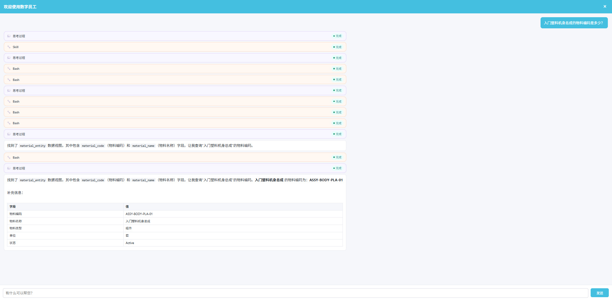

### 定时任务（可选）

定时任务用于让数字员工在设定的时间**自动执行一次问答，并把答案推送到关联渠道**（如钉钉、微信等 IM），适用于每日库存日报、每周巡检汇总等周期性场景。**此步为可选配置，不设置也能完成数字员工的创建与保存；仅当需要周期性自动问数并推送时才配置。**

在左侧菜单点击【定时任务】即可进入该页面（与基本设定、技能配置、知识配置、嵌入配置并列）。定时任务关联的是万悟运营管理中的**数字员工（dip）渠道**，而非某个具体数字员工本身——渠道里已保存问答所需的模型、APIKey 与数字员工信息，定时任务复用该渠道凭证到点问数并推送。

#### 关联渠道与列表

页面顶部【关联渠道】下拉列出当前用户/组织下全部可用的 dip 渠道（仅显示已配置 APIKey 的渠道，未配置的置灰不可选）。选择某渠道后，下方列表展示该渠道下的全部定时任务。

下拉中还提供【**全部任务（含已删除渠道）**】选项，选中后跨渠道列出当前用户创建的全部定时任务，包括关联渠道已被删除的【孤儿】任务，便于集中查看与清理。【全部】视图下，【来源渠道】列表头会出现筛选漏斗，点击可按来源渠道筛选（含已删渠道，已删渠道会标注【（已删除）】）。右侧提供任务名搜索框（输入关键字回车搜索）与刷新按钮，列表支持服务端分页。

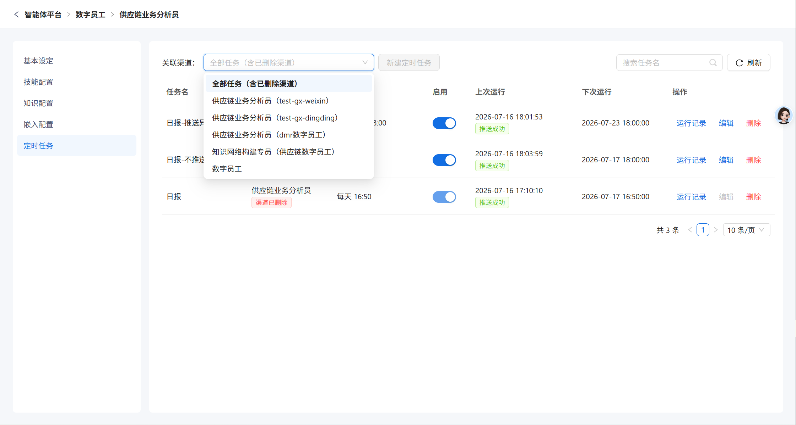

> 注：定时任务的增删改启停**独立于数字员工的发布状态**，即使数字员工已发布（查看模式）下也可随时管理其定时任务。

#### 新建/编辑定时任务

先选择具体渠道（【全部】视图下【新建定时任务】按钮禁用），再点击【新建定时任务】，在弹窗中填写：

- **任务名**：必填。
- **预设问题**：必填，到点后会自动把该问题发送给数字员工（wanwubot）执行并获取答案。
- **周期**：每天 / 每周。选「每周」时需选择星期。
- **执行时间**：HH:mm，到该时间点触发执行。
- **异常处理**：默认【不推送】（仅执行成功才推送，失败时静默）；可选【推送错误信息】——任务失败时把一段自定义文案推送到关联渠道用于运维告警，选中后需填写【任务失败默认推送文案】。

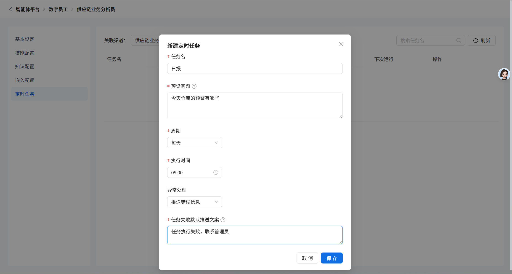

#### 启停、运行记录与删除

- **启用开关**：列表【启用】列可随时开启/停用任务，停用后到点不再执行。
- **运行记录**：点击操作列【运行记录】打开抽屉，查看该任务的历史执行记录，包括运行时间、状态（推送成功/执行成功/推送失败/执行失败）、耗时，以及每次的问题快照与答案。
- **编辑/删除**：可随时编辑任务配置或删除任务。删除后连同运行记录一并清除，不可恢复。

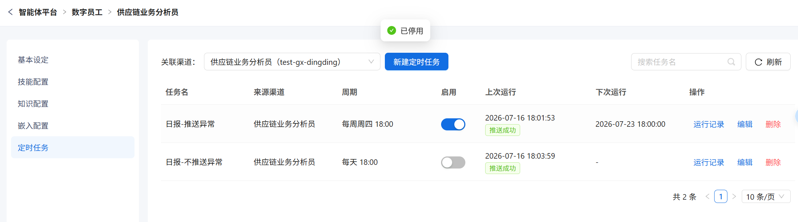

> 注：对于关联渠道已被删除的【孤儿】任务，仅支持查看运行记录与删除，不支持启停与编辑（渠道已删，凭证与推送链路已断，继续执行或改配置无意义）。

#### 到点执行

到点后，系统自动用渠道凭证向数字员工发起问数，仅推送最终正文（不含思考过程），并将答案以 Markdown 形式推送到关联渠道。执行结果会写入运行记录，任务列表的【上次运行/下次运行】也会实时更新。

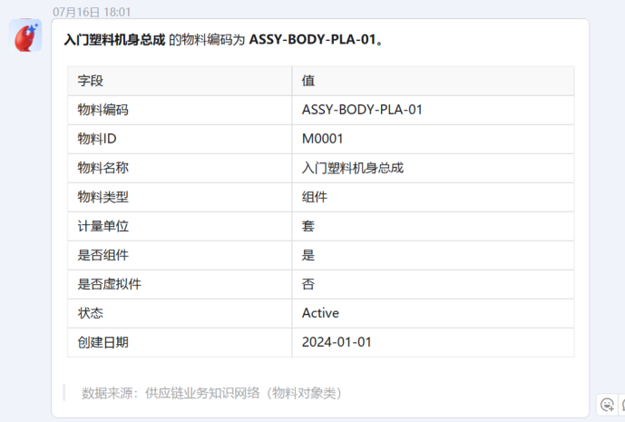

## 3.发布数字员工

发布数字员工时，应填写【角色】、【任务】、【工作流程】等必填信息后才可以发布。

点击数字员工卡片右上角【…】，选择【编辑】进入编辑页面，补充缺失信息， 后续信息填写与创建数字员工时一致，此处不再赘述。   

补充信息后，点击发布即可发布成功

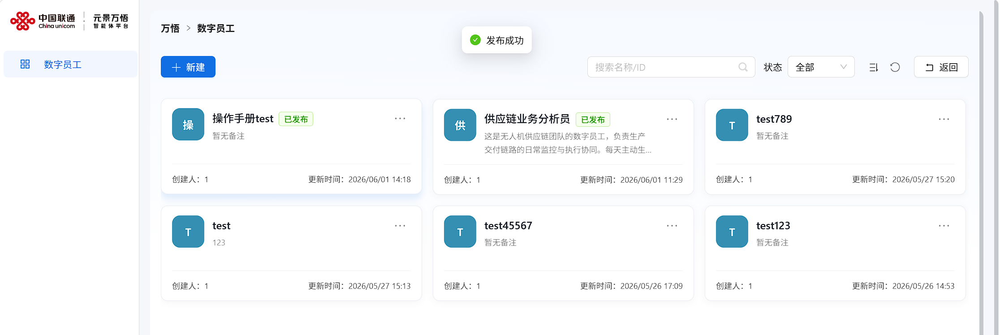

## 4.删除数字员工

对于已发布的数字员工，需要先取消发布，然后再删除。未发布的数字员工可以直接删除。

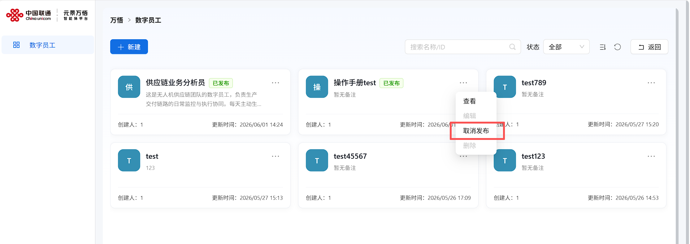

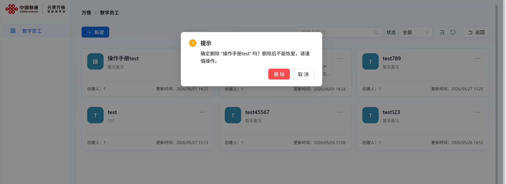
